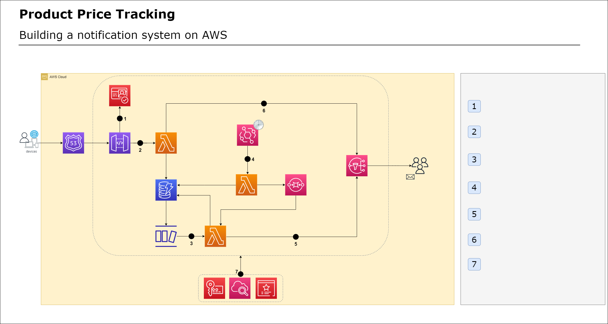

### The architecture of the project is as follows:

### About this repository:
- IaC using Terraform.
  - Check out the [terraform-infra](https://github.com/cdeucher/product-price-tracking/tree/master/terraform-infra/README.md) folder to see the code and requirements.
- AWS Lambdas to handle the backend logic.
  - Check out the [lambda-functions](https://github.com/cdeucher/python-api-lambdas) repository to see the code and requirements.
- Svelte frontend to interact with the backend.
  - Check out the [svelte-frontend](https://github.com/cdeucher/typescript-api-frontend) repository to see the code and requirements.

### How it works
#### User login and token authorization
- The user logs into the application using their Google account
- The user receives a token authorization that is used to verify their identity and permissions when making requests to the API Gateway
#### Adding a product to be tracked
- The user sends a request to the API Gateway with the URL of the product, the target price for the product, and their token authorization
- Cognito authenticates the request using the token authorization and triggers an AWS Lambda function to store the product URL and target price in a DynamoDB table
- The DynamoDB table has a stream configured to trigger another AWS Lambda function to scrape the website and update the table with the current price and name of the product
#### Subscribing to a product
- The user sends a request to the API Gateway with the product ID, their email address, and their token authorization
- Cognito authenticates the request and triggers an AWS Lambda function to add the user's email address to the SNS topic for the product ID
- The user receives an email to confirm their subscription
#### Receiving email notifications when the price drops
- The AWS Lambda function scrape the website and checks the price of the product every day
- If the price drops below the target price, the AWS Lambda function triggers the SNS topic to send an email notification to all subscribers
- The user receives an email notification when the price of the product drops below the target price

### Backlog
- `done` - Federated Identity with Google
- `done` - User create account with Google to authenticate with Cognito.
- `done` - Page where user can register the product link and price target to be monitored.
- `done` - API Gateway will invoke the AWS Lambda function and store the result in the DynamoDB table.
- `done` - Enable CORs in the API Gateway.
- `done` - Lambda function should use layers to reduce the size of the deployment package.
- `done` - Lambda function should use DynamoDB stream to scrape the website and update the result in the DynamoDB table.
- User subscribe a product to be monitored.
- User will receive an email when the product price drops below the target.
- User can unsubscribe a product.
- Lambda function cron job to scrape the website and update the result in the DynamoDB table.
- Lambda function should use DynamoDB stream to send an email notification to all subscribers when the price drops below the target price.

### Testing the API with Cognito
- Check out the [README-TEST.md](README-TEST.md) file to see how to test the API with Cognito.